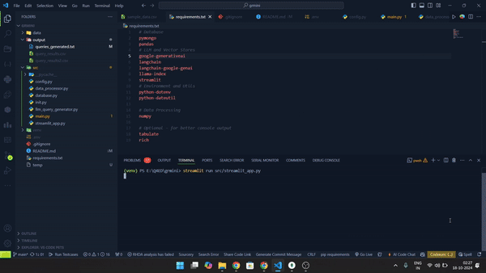

# Automated-Data-Query-and-Retrieval-System-Using-LLM-and-csv-langchain

# CSV Data Query with LLM


This project provides a Streamlit web application that allows users to upload CSV files, generate MongoDB queries using LLM (Language Learning Model), and save query results. The application uses Google's Gemini API for query generation and MongoDB for data storage.

## Project Structure
```
├── data/
│   ├── sample_data.csv
│   ├── try.py
│   └── uploaded_file.csv
├── output/
│   ├── queries_generated.txt
│   ├── query_results.csv
│   └── query_results2.csv
├── src/
│   ├── config.py
│   ├── data_processor.py
│   ├── database.py
│   ├── init.py
│   ├── llm_query_generator.py
│   ├── main.py
│   └── streamlit_app.py
├── venv/
├── .env
├── README.md
└── requirements.txt
```

## Prerequisites

- Python 3.8+
- MongoDB installed and running locally
- Google Gemini API key

## Installation

## Installation

1. Clone the repository:
```bash
git clone https://github.com/akshayram1/Automated-Data-Query-and-Retrieval-System-Using-LLM-and-csv-langchain.git
cd Automated-Data-Query-and-Retrieval-System-Using-LLM-and-csv-langchain
```

2. Create and activate a virtual environment:
```bash
python -m venv venv
source venv/bin/activate  # On Windows: .\venv\Scripts\activate
```

3. Install required packages:
```bash
pip install -r requirements.txt
```

4. Create a `.env` file in the root directory with the following configuration:
```
# MongoDB Configuration
MONGODB_URI=mongodb://localhost:27017/
DATABASE_NAME=product_database
COLLECTION_NAME=products

# Google Gemini API Configuration
GEMINI_API_KEY=your_gemini_api_key

# Application Configuration
DEBUG=True
CSV_CHUNK_SIZE=1000
```

## Running the Application

## Demo

Here's a quick demonstration of how the application works:



*The GIF above shows the basic workflow of uploading a CSV file, entering a query, and viewing results.*

You can run the application in two ways:

### 1. Using Streamlit (Web Interface)

1. Ensure MongoDB is running on your local machine:
```bash
mongod
```

2. Start the Streamlit application:
```bash
streamlit run src/streamlit_app.py
```

The application will be available at `http://localhost:8501`

### 2. Using Command Line

1. Ensure MongoDB is running on your local machine:
```bash
mongod
```

2. Run the application using Python:
```bash
python src/main.py
```

This will run the application in command-line mode, which is useful for testing or automation purposes.

## Usage

### Using Streamlit Interface:
1. Upload a CSV file using the file uploader
2. Enter your query in natural language in the text input field
3. The application will generate a MongoDB query based on your input
4. Click "Execute Query" to run the query and view results
5. Download the query results as a CSV file using the download button

### Using Command Line Interface:
1. Place your CSV file in the data directory
2. Run the application using `python src/main.py`
3. Follow the command-line prompts to process your data
4. Results will be saved in the output directory

## Features

- CSV file upload and processing
- Natural language to MongoDB query conversion using Gemini LLM
- Automatic database cleanup after each session
- Query result export to CSV
- Duplicate removal from query results
- Interactive data visualization (in Streamlit mode)
- Command-line interface for automated processing

## Important Notes

- The database is automatically deleted after each processing session for cleanup
- The application saves all generated queries in `output/queries_generated.txt`
- Query results are saved in `output/query_results2.csv for streamlit output `
- Query results are saved in `output/query_results.csv for command line output `
- Make sure to keep your Gemini API key secure and never commit it to version control

## Troubleshooting

1. If MongoDB connection fails:
   - Verify MongoDB is running locally
   - Check MongoDB connection string in `.env`
   - Ensure MongoDB port (27017) is not blocked

2. If Gemini API calls fail:
   - Verify your API key in `.env`
   - Check your internet connection
   - Ensure you have sufficient API credits


